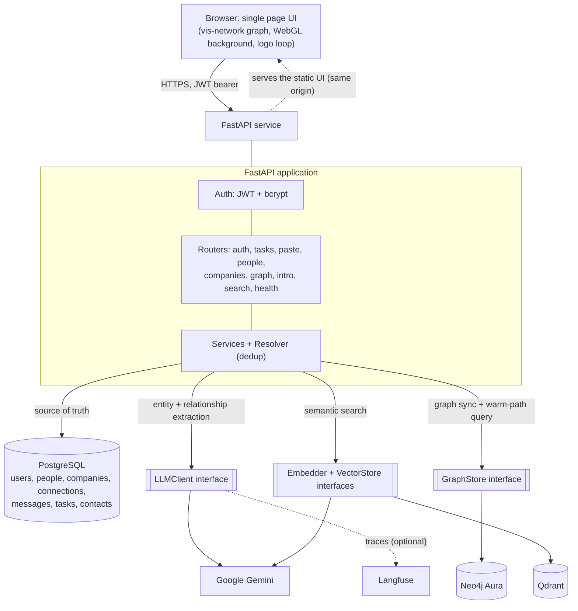

# Kith

Kith is a relationship intelligence platform. It reads the messages you get, extracts the
people and the companies behind them, maps how everyone is connected, and answers the
question that actually matters when you are job hunting or networking: who can get me into
a given company. It also runs a daily task list and a searchable, visual map of your
network.

Live: https://kith-1a3z.onrender.com

This is a personal product and a portfolio project. The goal was to build something real
end to end: ingestion, an AI extraction pipeline, a relational source of truth, a graph
database for traversal, a vector index for semantic search, observability, evaluations,
a single-page UI, and a public deployment.

## What it does

- Capture contacts three ways: paste an email or message and let AI extract the entities,
  add a person by hand, or click a person in the graph to add someone they know.
- Build a relationship graph of people, companies, and the links between them
  (works at, knows, referred, can introduce).
- Answer warm-path questions: "who can get me into Notion" returns a path such as
  You, Dipunj, Rahul, Qualcomm.
- Search the network by meaning, not keywords ("who do I know in fintech").
- Keep a daily task list with optional deadlines and priorities.
- Store contact details (role, email, phone, LinkedIn) and open Gmail compose or a
  LinkedIn profile in one click.

## Architecture



### How the pieces fit

- **Single source of truth is PostgreSQL.** Neo4j and Qdrant are derived stores that are
  rebuilt from Postgres. This keeps writes simple and means an outage in a derived store
  never blocks the core app.
- **The AI layer sits behind an `LLMClient` interface.** The Gemini implementation does
  structured-output extraction with an automatic fallback to a second model when the
  primary is overloaded, and raises a typed error so the API can return a clean 503
  instead of a crash. Swapping providers is a new class, nothing else changes.
- **Neo4j is used where a graph database earns its place:** multi-hop traversal. The
  "who can get me into X" query walks You to a contact to a person who works at the target
  company. That is awkward in SQL and natural in Cypher. It sits behind a `GraphStore`
  interface with a real Neo4j store and an in-memory fake, so the test suite needs no
  database.
- **Semantic search uses Gemini embeddings indexed in Qdrant**, behind `Embedder` and
  `VectorStore` interfaces with fakes for testing.
- **Observability is optional and non-blocking.** A tracer records each extraction to
  Langfuse when keys are present and is a no-op otherwise, so it never affects local runs
  or tests.
- **Deduplication** is centralized in a Resolver: the same person referenced more than
  once collapses to a single node by normalized name, used by both paste ingestion and
  manual entry.

## Tech stack

| Area | Choice |
|------|--------|
| API | FastAPI (Python) |
| Auth | JWT (PyJWT) with bcrypt password hashing |
| Relational store | PostgreSQL via SQLAlchemy 2.0 (SQLite for local and tests) |
| Graph store | Neo4j (Aura free tier) |
| Vector store | Qdrant (local mode) with Gemini embeddings |
| AI | Google Gemini (structured output) behind a provider-agnostic interface |
| Observability | Langfuse (optional) |
| Frontend | Single static HTML page, vanilla JS, vis-network, WebGL gradient |
| Tests | pytest, fully hermetic (fakes for AI, graph, and vector layers) |
| Deployment | Render web service, Neon PostgreSQL, Neo4j Aura |

## Data model (PostgreSQL, source of truth)

- `users`: account with bcrypt-hashed password.
- `people`: a contact (name, title, current company link, source message).
- `companies`: a company, deduplicated per user by normalized name.
- `connections`: directed person-to-person edges with a relation type
  (knows, referred, can_intro).
- `messages`: raw captured text plus a processed flag.
- `contacts`: one-to-one with a person, holding email, phone, and LinkedIn.
- `tasks`: a to-do with optional deadline and priority.

Neo4j mirrors people, companies, and connections as a queryable graph. Qdrant holds one
embedding per person for semantic search.

## API overview

All data endpoints require a JWT bearer token.

- `POST /auth/register`, `POST /auth/login`, `GET /auth/me`
- `POST /paste`: extract people, companies, and relationships from a message
- `POST /people`, `DELETE /people/{id}`, `GET /people/{id}`, `PATCH /people/{id}`
- `DELETE /companies/{id}`
- `GET /graph`: the network as nodes and edges
- `POST /graph/sync`: rebuild the user subgraph in Neo4j
- `GET /intro-paths?company=...`: warm paths to a company
- `POST /search/reindex`, `GET /search?q=...`: semantic search
- `GET /tasks`, `POST /tasks`, `PATCH /tasks/{id}`, `DELETE /tasks/{id}`
- `GET /health`

## Run it locally (no Docker)

The whole app runs against a local SQLite file, so nothing external is required to start.

```bash
cd backend
python -m venv .venv
.venv\Scripts\activate            # Windows. macOS or Linux: source .venv/bin/activate
pip install -r requirements-dev.txt

set DATABASE_URL=sqlite:///./kith_local.db   # PowerShell: $env:DATABASE_URL="sqlite:///./kith_local.db"
python -m uvicorn app.main:app --reload
```

Open http://localhost:8000, register an account, and start adding contacts. Pasting a
message and semantic search need a Google Gemini API key in `backend/.env`
(`GEMINI_API_KEY=...`). Neo4j warm paths need Neo4j credentials in the same file. Both
features degrade gracefully when their keys are absent.

### Tests

```bash
cd backend
python -m pytest -q
```

The suite is hermetic: the AI, graph, and vector layers use in-memory fakes, so no API
keys or external databases are needed.

### Evaluations

Extraction quality is measured against a fixed dataset with a precision, recall, and F1
scorer:

```bash
cd backend
python -m evals.run_evals     # uses a real Gemini key
```

## Deployment

- Single Render web service runs the FastAPI app and serves the UI from the same origin.
- PostgreSQL is hosted on Neon (persistent), Neo4j on Aura, Gemini and Qdrant as
  configured.
- A lifespan task pings the service every ten minutes (and an external HTTP monitor backs
  it up) so the free host does not cold start between visits.
- Configuration is environment driven: `DATABASE_URL`, `JWT_SECRET`, `GEMINI_API_KEY`,
  `NEO4J_*`, and optional `LANGFUSE_*`.

## Project structure

```
backend/
  app/
    main.py            app wiring, static mount, keep-alive
    config.py          settings
    database.py        SQLAlchemy engine and session
    security.py        bcrypt and JWT
    deps.py            auth and dependency injection
    models/            User, Company, Message, Person, Connection, Task, Contact
    schemas/           request and response models
    routers/           auth, paste, people, companies, graph, intro, search, tasks, health
    services/          ingest, resolver, graph_sync, graph_view, people, contacts, tasks
    llm/               LLMClient interface, Gemini implementation, errors
    graph/             GraphStore interface, Neo4j and fake implementations
    search/            Embedder and VectorStore interfaces and implementations
    observability/     tracer (Langfuse or no-op)
  evals/               dataset, scorer, runner
  tests/               18 hermetic test modules
frontend/
  index.html           single-page UI
docs/superpowers/      specs and implementation plans for each phase
```

## Disclaimer

Built by Archit Shukla. I designed the system, made the architecture and product
decisions, chose the data stores and the boundaries between them, and integrated and
deployed it. Claude Code (Anthropic) was used as a pair-programming assistant to help
implement and review code under that direction. The design, the decisions, and the
ownership of this project are mine.
